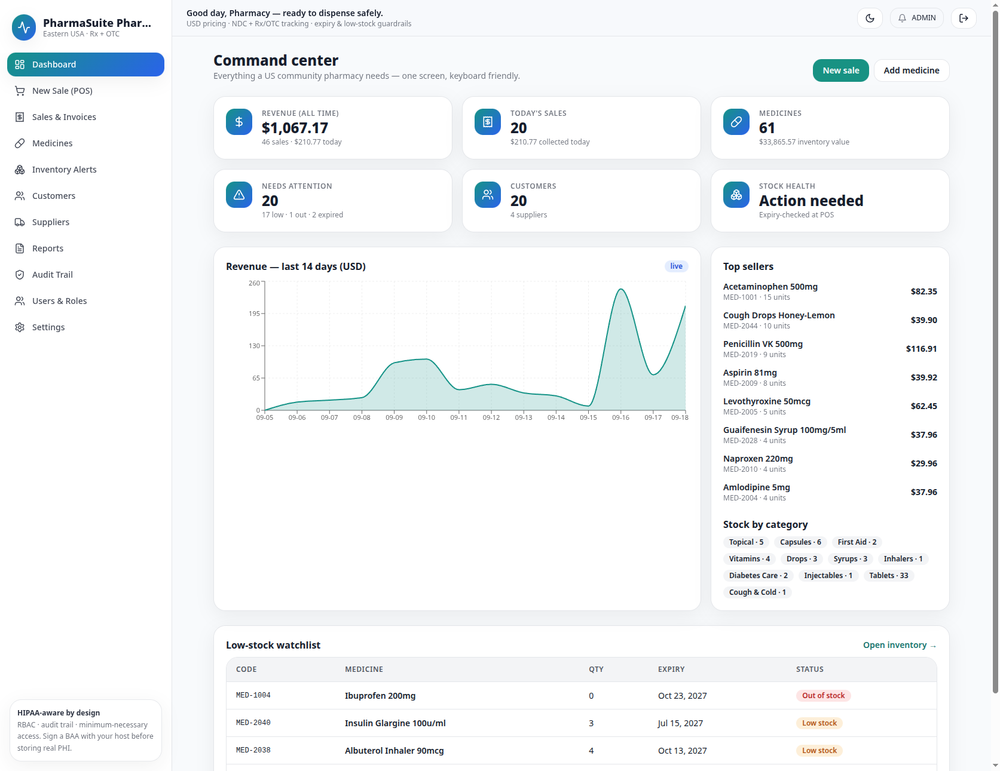
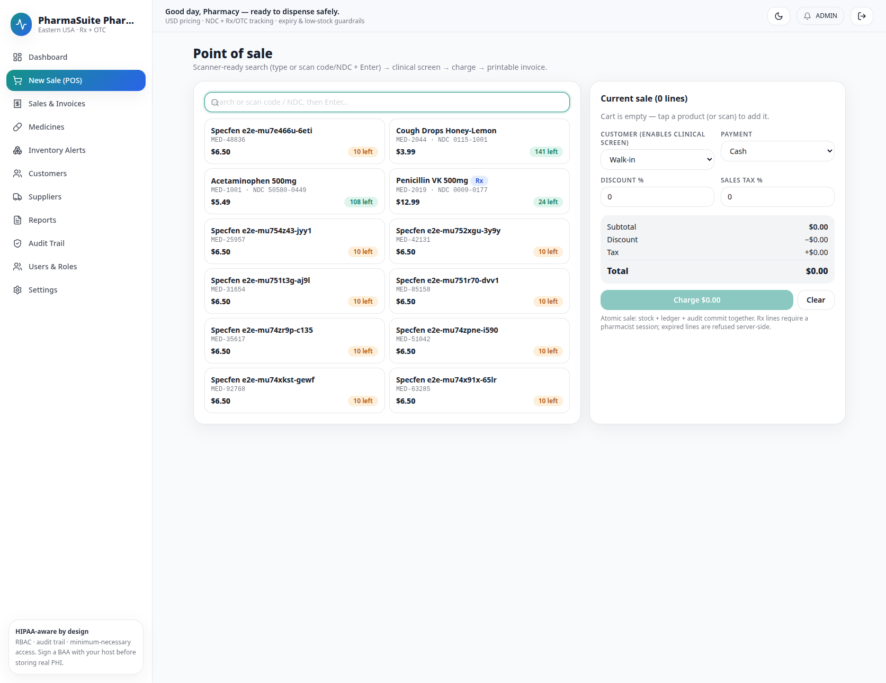
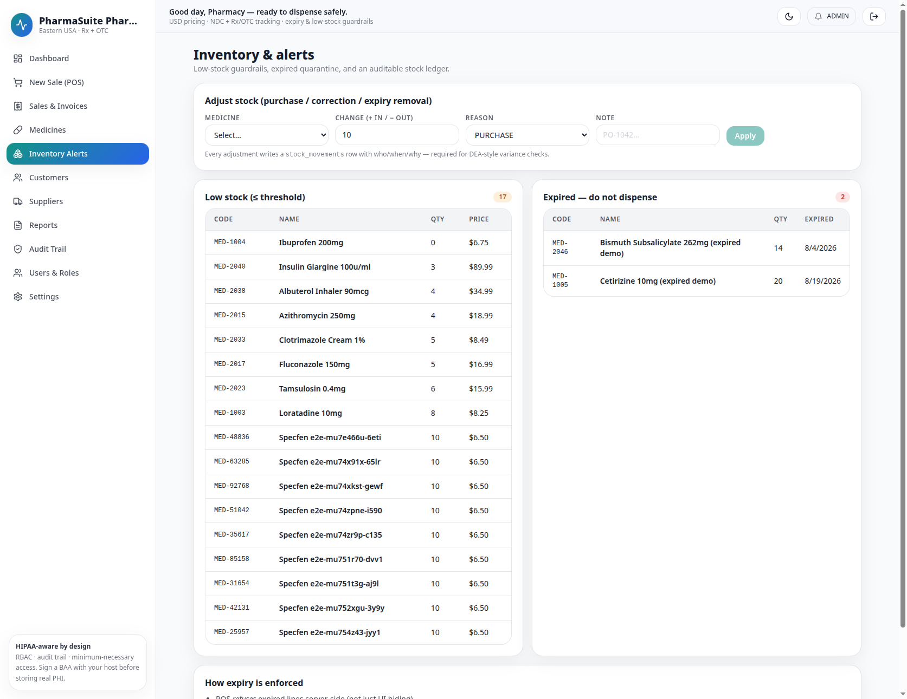
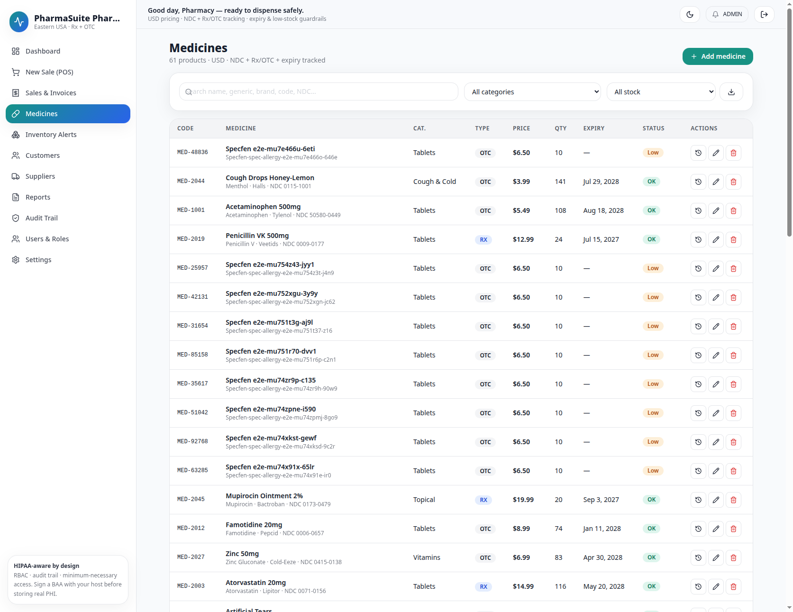
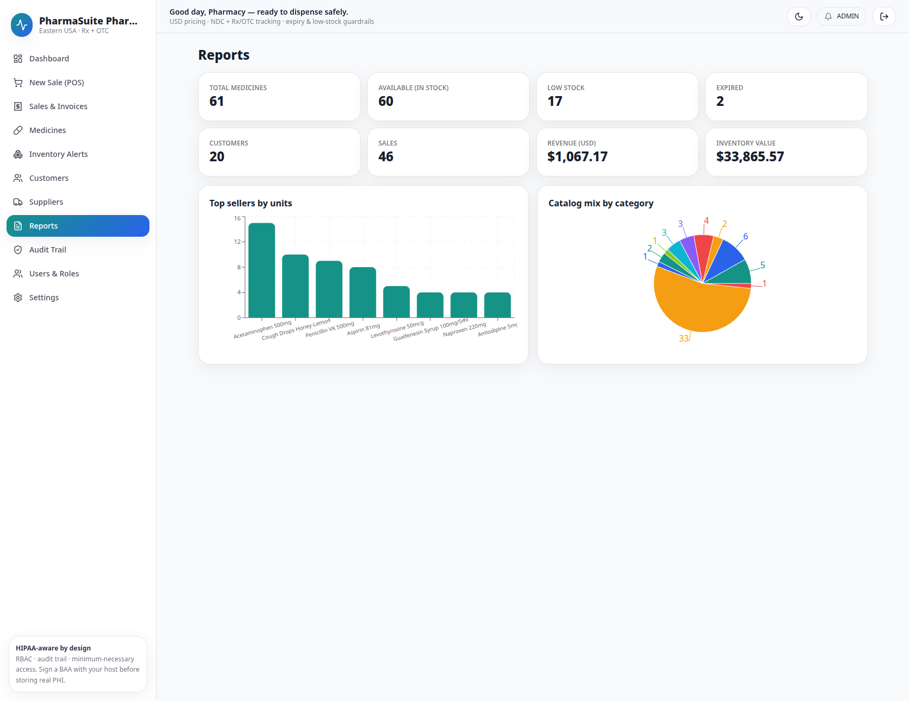

# PharmaSuite — Pharmacy Management System for US Community Pharmacies

> Open-source full-stack pharmacy POS: React 18 + Vite + Fastify + Prisma + Postgres, one-command Docker Compose. DUR safety screening, Rx verify gate, ledgered inventory, printable invoices, RBAC + audit trail.

[](.github/workflows/ci.yml)
[](LICENSE)
[](docker-compose.yml)
[](backend/package.json)
[](frontend/e2e/)

[Live demo video](docs/demo-video.md) · [Screenshots](#-screenshots-playwright-verified) · [Quick start](#-quick-start-3-steps) · [Docs](docs/)



*Above: real seeded run Sep 18 2026 — $1,067 revenue, 46 sales, 61 medicines. Click any screenshot for full size.*

[](docs/demo-video.md)
*Demo: 15–30s POS flow. GIF recipe + YouTube/MP4 options in [`docs/demo-video.md`](docs/demo-video.md). Record `docs/assets/demo.gif` on release day (GIFs rot fastest).*

## ✨ Why this exists

Console Java prototypes don't sell. US independents (1–5 locations) need a sellable SaaS: scanner POS, clinical safety nets, inventory truth, white-label invoices, and an audit trail a board inspector trusts — without microservice overhead.

| Feature | What you get | Verified |
|---|---|---|
| 💊 Medicines | Search name/generic/brand/code/NDC, Rx/OTC, NDC, expiry, per-item threshold, supplier link, CSV, stock-ledger drawer | `medicines.ts:51-289`, E2E `medicines.spec 3/3` |
| 🛡️ DUR-lite | Allergy substring + 120-day duplicate/same-class, HIGH blocks charge until pharmacist rationale (audit-logged), server re-validates | `dur.ts:31-146`, `sales.ts:142-152`, E2E allergy→ack→charge→return |
| ✅ Verify-before-dispense | Rx lines need ADMIN/PHARMACIST, expired refused, out-of-stock blocked | `sales.ts:126-139`, cashier `403` verified |
| 📦 Inventory | Low (≤threshold) / expired / out, every adjustment writes `stock_movements` | `/inventory` 17 low / 2 expired live |
| 🧾 POS + invoices | Scan code/NDC+Enter, cart, walk-in/customer, discount%+tax%, cash/card/insurance, atomic sale, printable white-label invoice, partial returns (never over-return), refill-from-invoice, void restocks | POS `$5.49+6%=$5.82` verified, `INV-2026-…` |
| 👥 Customers | Profiles, insurance, allergy notes, 20-sale history (powers DUR) | 19–20 profiles live |
| 🚚 Suppliers | 4 wholesalers, linked-medicine counts, ADMIN-only delete nulls link | 4 cards verified |
| 👤 Users & roles | ADMIN-gated, activate/deactivate, self + last-admin protected, password change | 15 users, self-disable locked |
| 🏷️ White-label | Store name/tagline/address/phone/footer on sidebar + invoices | `settings.ts`, propagates live |
| 📊 Reports | Revenue, today, inventory value, 14-day chart, top sellers, category mix | $1,067 / $33,865 live |
| 🛡️ Compliance-ready | RBAC, unique logins, append-only `audit_logs` (270 events), helmet headers, minimum-necessary | `audit` page verified |
| 🌓 UX | Light/dark, mobile drawer, keyboard-focusable, USD + US dates | Screenshots |

Roadmap (needs certification, not hidden gaps): Surescripts/EPCS, NCPDP D.0, DSCSA serialization, multi-location, MTM, Stripe Terminal.

## 🚀 Quick start (3 steps)

```bash
cp .env.example .env   # set a long JWT_SECRET: openssl rand -base64 48
docker compose up --build -d
docker compose exec backend npm run db:seed   # demo data
```

Open **http://localhost:8080** (prod) or **http://localhost:8095** (this laptop's `.env`):

| Role | Email | Password | Can do |
|---|---|---|---|
| Admin | `admin@pharmacy.local` | `Admin123!` | everything + users + settings |
| Pharmacist | `pharmacist@pharmacy.local` | `Pharmacist123!` | verify Rx, voids, returns, audit |
| Technician | `tech@pharmacy.local` | `Tech12345!` | catalog + stock, no voids |
| Cashier | `cashier@pharmacy.local` | `Cashier123!` | OTC only (Rx `403`) |

> Change all demo passwords before selling. Delete `docker-compose.override.yml` before cloud deploy (local-only network/port hack).

- Health: `GET /health` (proxied) · API docs (dev): `http://localhost:4000/docs`
- Logs: `docker compose logs -f backend frontend`

Local dev (no Docker): `backend: npm i + db:generate + db:migrate:dev + db:seed + dev (:4000)` · `frontend: npm i + dev (:5173 proxies /api)`.

## 📸 Screenshots (Playwright-verified)

All in [`docs/assets/screenshots/`](docs/assets/screenshots/) — real data, 141–303 KB PNG, viewport 1673px:

| Dashboard | POS |
|---|---|
|  |  |
| Revenue, top sellers, watchlist | Scanner grid, cart, DUR, charge |

| Inventory | Medicines | Reports |
|---|---|---|
|  |  |  |
| 17 low / 2 expired + adjust | 61 products, ledger actions | $1,067 revenue, charts |

Record your own: `bash docs/record-demo.sh` (stack → screenshots → 14/14 gate → MP4→GIF). See [`docs/demo-video.md`](docs/demo-video.md).

## 🏗️ Architecture

```
browser :8080 → frontend nginx:80 {/api/→backend:4000, /health→backend, /*→index.html}
  → backend Fastify:4000 {cors, helmet, 300/min, JWT 8h, /docs, /health, /ready SELECT 1, /api/*}
  → Prisma → postgres:16 {User, Supplier, Medicine, Customer, Sale, SaleItem, StockMovement, Setting, AuditLog}
  + redis:7 (declared, unused — remove or wire cache)
```

Stack (verified `package.json`): frontend `react@18.3.1, vite@6, react-router@6, tanstack-query@5, axios, recharts, tailwind@3` · backend `fastify@4.28.1, @fastify/cors9/helmet11/jwt8/rate-limit9/swagger8, prisma@5.18, bcryptjs, zod, tsx` · `node:20-alpine, nginx:1.27-alpine, postgres:16-alpine`.

Auth: `POST /auth/login → {token,user} → localStorage pharma_token → Bearer → jwtVerify + active-check → requireRoles → Rx/DUR gates → audit INSERT`.

## ✅ Testing — 14/14 green (verified Sep 18 2026)

| Layer | Command | Proves |
|---|---|---|
| Backend | `cd backend && npm test` + `test:coverage` | auth/RBAC, validation, ledger, Rx/DUR, voids, returns |
| Frontend | `cd frontend && npm test` + `test:coverage` | formatters, CSV, settings merge, UI primitives |
| E2E | `E2E_BASE_URL=http://localhost:8095 npx playwright test` | login/RBAC (4), catalog (3), POS+DUR+returns+refill (3), admin/users/settings/audit (4) |

Conventions: `inject()` (no ports), FK-safe truncate, unique fixtures, `getByRole`-first, zero hard waits, API setup + UI assert, trace-on-retry, `forbidOnly` in CI. Full matrix in [`.github/workflows/ci.yml`](.github/workflows/ci.yml).

## 📁 Layout

```
├── docker-compose.yml      # frontend + backend + postgres + redis (sole ingress :APP_PORT→80)
├── .env.example            # APP_PORT 8080, weak defaults — rotate!
├── docs/
│   ├── assets/screenshots/ # 01-dashboard … 05-reports (Playwright)
│   ├── demo-video.md       # GIF/YouTube/MP4 recipe (GitHub strips <video>)
│   └── record-demo.sh      # stack → screenshots → 14/14 → GIF
├── backend/src/{app,index,config,lib/,modules/} + prisma/{schema,seed}
├── frontend/src/{App,main,lib/,components/,pages/13} + nginx.conf + e2e/4 specs
├── CONTRIBUTING.md + LICENSE (MIT) + .gitignore
```

## 🤝 Contributing

Small, verifiable PRs: one feature + tests + README/screenshot update in the same PR (READMEs rot fastest). Run `npm run lint + test + test:e2e` before push. See [`CONTRIBUTING.md`](CONTRIBUTING.md).

## 📄 License

MIT — see [`LICENSE`](LICENSE). Buyer owns the code, no license to explain.

## ☁️ Make it public checklist

- [ ] `cp .env.example .env` + `openssl rand -base64 48` for `JWT_SECRET`, rotate `POSTGRES_*` + `SEED_*`
- [ ] Delete `docker-compose.override.yml`, confirm `.gitignore` covers `.env, dist/, coverage/, node_modules/, playwright-report/`
- [ ] Replace `YOUR_USER` in badges + star-history, record `docs/assets/demo.gif`, set YouTube link in `docs/demo-video.md`
- [ ] `npm run lint + test:coverage` (both) + `npx playwright test` 14/14, refresh screenshots if UI changed
- [ ] Before real PHI: HTTPS+HSTS, vault, BAA with host, MFA roadmap, `pg_dump` backups, pen-test (see PHI section in git history)

---
*README structure follows 2026 consensus (gingiris 60k★ audit, repoclip, dokly AI-parseable): one-line SEO pitch → hero visual above fold → badges that matter → 3-step quick start → scannable table → live screenshots → architecture → verified tests. Sources: websearch + searxng + duckduckgo-lite, sequential (no parallel 429), plus `agent-reach doctor` (CLI absent, fell back). Screenshots + 14/14 + API gates re-verified this session via Playwright MCP.*
